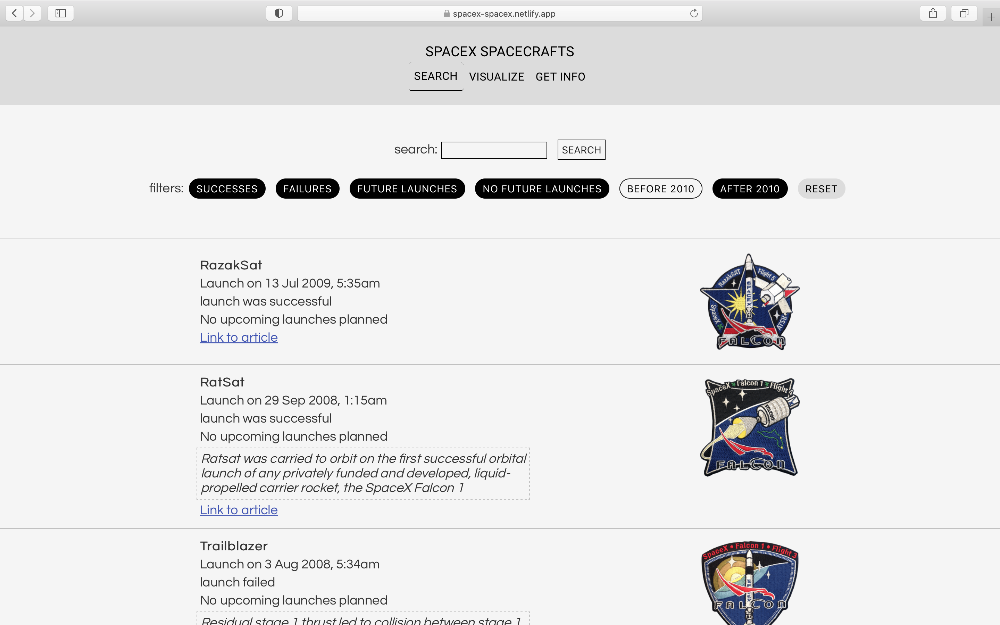
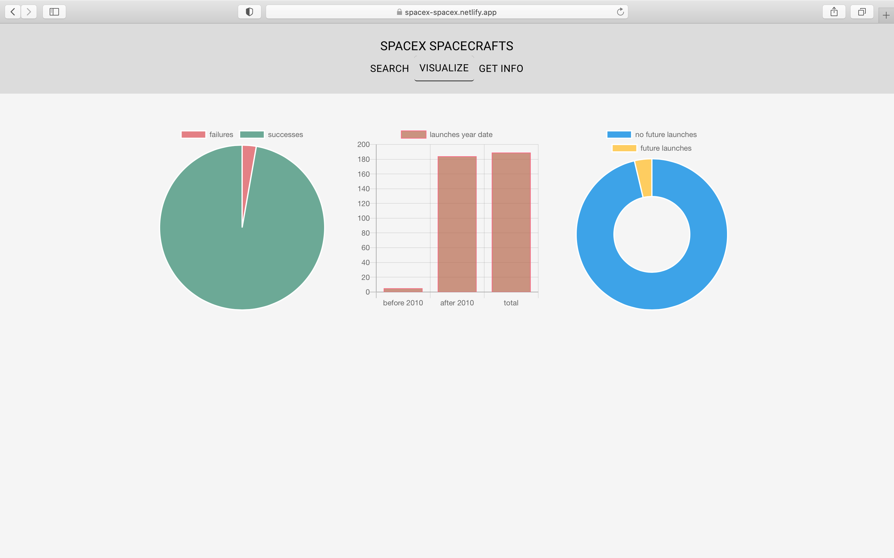

## SpaceX app with React

This web app displays data about spaceX using the Open Source REST API [spaceX](https://github.com/r-spacex/SpaceX-API): it allow users to search, filter, and visualize information. The app is fully responsive and features infinite scroll.

[**visit live app**](https://spacex-spacex.netlify.app/search)

## Features

- get data about SpaceX through API call (via Redux thunk)
- infinite scroll when retrieving data
- search information about the launches
- filter out information (success/failure, year date, future/no future launches)
- data visualization (success/failure, year date, future/no future launches)

## Future improvements

- add a text highlight feature for search
- add more tests

## Tech

**Stack**: JavaScript, React, Redux, Redux Thunk, chart.js, Jest  
**Styling**: SASS/SCSS, styled-components, postCss Normalize  
**Deployment**: Netlify

## Visuals

